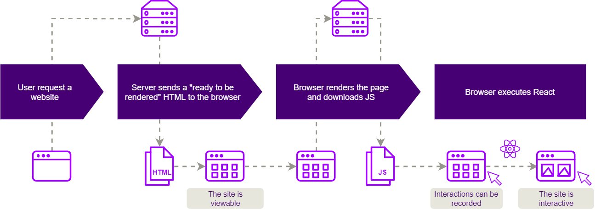

# Lab 00 - Key concepts

- [Lab 00 - Key concepts](#lab-00---key-concepts)
  - [Client-side rendering (CSR) and single-page applications (SPA)](#client-side-rendering-csr-and-single-page-applications-spa)
  - [Server-side rendering (SSR)](#server-side-rendering-ssr)
  - [Static site generation (SSG)](#static-site-generation-ssg)
  - [CSR vs SSR](#csr-vs-ssr)
    - [Benefits of SSR](#benefits-of-ssr)
    - [Risks of SSR/SSG](#risks-of-ssrssg)
  - [Best projects to move to SSR or SSG](#best-projects-to-move-to-ssr-or-ssg)

## Client-side rendering (CSR) and single-page applications (SPA)

**Client-side rendering** (**CSR**) is an application's ability to entirely render content in the browser with JavaScript.

When the user request a website, instead of getting all the content from the HTML document itself, a bare-bones HTML document is received. The browser also downloads all JavaScript files and executes the scripts to make API requests and fetch the dynamic content. After the server responds, the final content is rendered using DOM processing in the client's browser and the page is fully visible and interactive.

With client-side rendering, the initial page load is naturally a bit slow. However, after that, every subsequent page load is faster. The web application interacts with the user by dynamically rewriting the current web page with new data from the web server, instead of the default method of a web browser loading entire new pages. This model supports **single-page applications** (**SPAs**).

## Server-side rendering (SSR)

Server-side rendering (SSR) is an application's ability to convert HTML files on the server into a fully rendered HTML page for the client.

The browser send a request to the server, which compiles and prepares the HTML content after traversing through server-side scripts, sending a fully rendered HTML page to the browser. Once the HTML has been delivered, the user is able to access the content on the page without having to wait for all the JavaScript to be downloaded and executes.

## Static site generation (SSG)

Static site generation describes the process of compiling and rendering HTML files during build time from templates or components, rather than during runtime as SSR.

When the user requests a webpage, a pre-made static HTML page is sent to the browser. The build process is handled before the pages are requested by the client. The browser also downloads all the required static assets as JavaScript and CSS files. Each content update will require a new deployment to re-generate the static HTML pages.

Sites built on this type of architecture often make use of pre-rendered static pages served over CDNs, can get data from multiple sources, and replace traditional servers and their databases with micro service APIs.

## CSR vs SSR

### Benefits of SSR

- **Search Engine Optimization** (**SEO**). SSR/SSG offer a SEO friendly way of building websites and applications when compared to traditional SPAs. Search engines can easily index and crawl content because it can be rendered before the page is loaded.
- **Performance**. A server-side rendered application enables pages to be rendered and visible faster, improving metrics such as time to first draw (TTFD) or first contentful paint (FCP) and the user experience, particularly for users with slow internet connection or outdated devices.
- **Social Sharing**. With SSR/SSG you can programmatically customize the Open Graph meta titles for each page, which is also relevant to SEO and makes your URLs look much better in social media.
- **Indexation**. SSR / SSG web pages will potentially be indexed correctly because web browsers prioritize web pages with faster load times.

### Risks of SSR/SSG

- **Memory and processing power on the server**. Rendering server-side can be costly and resource-intensive and the server could take on the full burden of rendering content for users and bots.
- **Higher TTFB**. TTFB is the time to first byte, seen as the time between clicking a link and the first bit of content coming. While rendering static HTML server-side is efficient, rendering bigger and more complex applications server-side can increase load times due to the bottleneck.
- **Higher latency**. SSR sites tend to get a high latency if you get lots of traffic at the same time, which delays/slows down the browsing experience for everyone.
- **Caching**. Due to frequent server requests and full page reloads can result in overall slower page rendering, configuring the cache is more complex but usually required to provide better user experience on SSR sites.
- **Compatibility**. Server-side rendering may not be compatible with third-party JavaScript code.

## Best projects to move to SSR or SSG

Depending on the web application and what are functional and non-functional requirements,we can define few scenarios to use different rending modes. Static site generation and server-side rendering are two forms of pre-rendering (generates HTML for each page in advance) specially well suited for those that require attention to SEO and performance.

The SSR approach is good for building complex web applications where content and SEO is relevant, require user interaction, rely on a database and the content could change very often. Examples: e-commerce sites, news and blogs and other dynamic content sites.

The SSG mode is a great choice for simple applications in which the content is also relevant but typically doesn’t change based on the user’s actions. It is not suitable for interactive web applications that require to be rebuilt every time new input is provided. Examples: corporate site, personal webpage, landing and other static pages.

Finally, in CSR content is rendered in the browser using the client-side JavaScript library increasing the time to be visible for the user, however, rendering process for new requests tends to be faster. It is recommended for SPAs and dynamic platforms with complex interfaces where content and SEO is less relevant, prioritizing the user interaction. Examples: software-as-a-Service (SaaS) solution, customer support portal, back-office dashboard, closed community social network, etc.

> Learn more about [Rendering strategies on the Web](https://developers.google.com/web/updates/2019/02/rendering-on-the-web).
