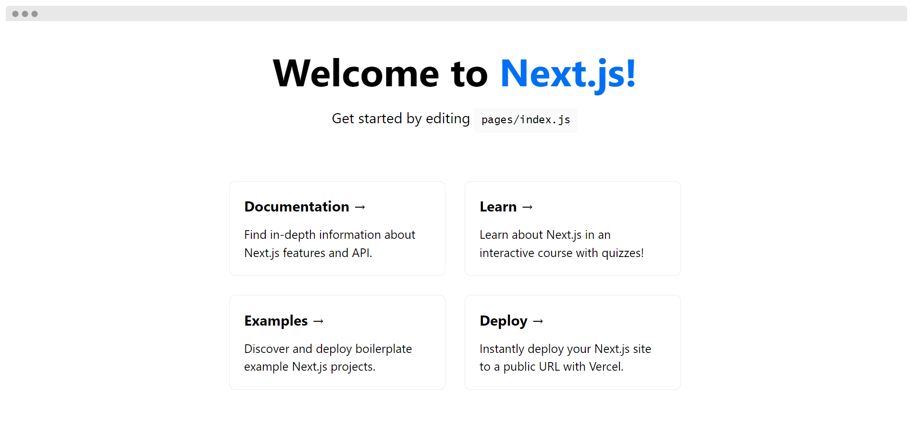

# Lab 01 - Introduction to Next.js

- [Lab 01 - Introduction to Next.js](#lab-01---introduction-to-nextjs)
  - [What is Next.js](#what-is-nextjs)
  - [Main features of Next.js](#main-features-of-nextjs)
  - [Installation](#installation)
  - [Next.js application structure](#nextjs-application-structure)
  - [Pages in Next.js](#pages-in-nextjs)
    - [Special custom pages](#special-custom-pages)
  - [📖 Resources to learn more](#-resources-to-learn-more)

## What is Next.js

**[Next.js](https://nextjs.org/)** is an **open-source React front-end development web framework** created by Vercel that enables functionality such as server-side rendering and generating static websites for React based web applications. It is a production-ready framework that allows developers to quickly create **static and dynamic Jamstack websites**.

**Note**: [JAMstack](https://jamstack.org/), previously stylized as _JAMStack_ (stands for Javascript, API and Markup), is an architecture designed to make the web faster, more secure, and easier to scale. The core principles of pre-rendering, and decoupling, enable sites and applications to be delivered with greater confidence and resilience than ever before. It has revolutionized the way we think about building for the web by providing a simpler developer experience, better performance, lower cost and greater scalability.

Next.js is an integral part of the React ecosystem developed specifically to address the SSR/SSG challenge for React applications.

## Main features of Next.js

- **Image Optimization**. `<Image>` and Automatic Image Optimization with instant builds.
- **Internationalization**. Built-in Domain & Subdomain Routing and Automatic Language detection.
- **Next.js Analytics**. A true lighthouse score based on real visitor data & page-by-page insights
- **Zero Config**. Automatic compilation and bundling. Optimized for production from the start.
- **Hybrid: SSG and SSR**. Pre-render pages at build time (SSG) or request time (SSR) in a single project.
- **Incremental Static Regeneration**. Add and update statically pre-rendered pages incrementally after build time.
- **TypeScript Support**. Automatic TypeScript configuration and compilation.
- **Fast Refresh**. Fast, reliable live-editing experience, as proven at Facebook scale.
- **File-system Routing** .Every component in the pages directory becomes a route.
- **API Routes**. Optionally create API endpoints to provide backend functionality.
- **Built-in CSS Support**. Create component-level styles with CSS modules. Built-in Sass support.
- **Code-splitting and Bundling**. Optimized bundle splitting algorithm created by the Google Chrome team.
- **Hot Reloading**. Application refresh is not needed in development mode. The idea behind hot reloading aka "hot module reloading" is to keep the app running and to inject new versions of the files that you edited at runtime without refresh the entire application.

## Installation

Next.js requires a **Node version 10.13 or later**.

> ✏ Install [Node](https://nodejs.org/), if it is not installed.

To easiest way to start a new Next.js project is to create it automatically by using `create-next-app`:

```bash
npx create-next-app
# or
yarn create next-app
```

There are several [options](https://nextjs.org/docs/api-reference/create-next-app) for configuring this initial app and many [official Next.js examples](https://github.com/vercel/next.js/tree/canary/examples) that can be used in place of the default template.

You also can setup manually by installing `react`, `react-dom` and `next`.

> ✏ Create a new root directory for the project.
>
> Run `npx create-next-app` or `yarn create next-app`.
>
> Accept if you are asked to install the create-next-app package.
>
> Provide a project name when required. To follow this example: `next-app`.
>
> After the installation is complete, navigate to the `next-app` directory.
>
> Run `npm run dev` or `yarn dev` to start the development server on port 3000.
>
> Visit http://localhost:3000 to view your application.

Once the server is running, you should see a page like this one when you access http://localhost:3000:



By using `create-react-app`, a list of scripts is available to facilitate application development at different stages:

- `next dev`. To start Next.js server in development mode.
- `next build`. To create an optimized production build of your application.
- `next start`. To start Next.js server in production mode. The application must be compiled with `next build` first.
- `next lint`. To set up ESLint if it is not already configured and check ESLint warnings or errors in the application.

## Next.js application structure

The package `create-next-app` creates a new Next.js application with the following folder structure:

```text
next-app
├── node_modules
├── pages
│   ├── api
│   │   └── hello.js
│   ├── _app.js
│   └── index.js
├── public
│   ├── favicon.ico
│   └── vercel.svg
├── styles
│   ├── global.css.ico
│   └── Home.module.css
├── .eslintrc.json
├── .gitignore
├── next.config.js
├── package-lock.json | yarn.lock
├── package.json
└── readme.md
```

When it comes to structuring a Next.js application the ideal folder organization is the one that allows you to move around your code with the least amount of effort, encouraging scalability but also reusability.

One common design pattern is to move app-related code to a new `src` directory and create other new directories to place React components, tests, custom hooks, interfaces, etc. depending on the needs. This approach is great for small projects because it makes it obvious where your files should be located and many developers are familiar with.

The src directory is supported by Next.js by default, but consider that config files like next.config.js should be inside the root directory and moving them to src won't work. The same goes for the public directory:

```text
next-app
├── node_modules
├── public
│   ├── favicon.ico
│   └── vercel.svg
├── src
│   ├── components
│   ├── hooks
│   ├── layouts
│   ├── pages
│   │   ├── api
│   │   │   └── hello.js
│   │   ├── _app.js
│   │   └── index.js
│   ├── services
│   ├── styles
│   │   ├── global.css.ico
│   │   └── Home.module.css
│   ├── test
│   └── utils
├── .eslintrc.json
├── .gitignore
├── next.config.js
├── package-lock.json | yarn.lock
├── package.json
└── readme.md
```

However, while it's great at the beginning, you'll realize at some point and depending on the size of your project that the main issue with this design is its lack of scalability. To solve this, we can refactor and group the code by functional modules instead of technical concepts and keep the dependencies between the modules to an absolute minimum. Code that is related to each other is grouped together in the `src/modules` directory and those that don't really fit in any module or that can be reused by the functional modules is moved to the `src/common` directory:

```text
next-app
├── node_modules
├── public
│   ├── favicon.ico
│   └── vercel.svg
├── src
│   ├── common
│   │   ├── components
│   │   ├── hooks
│   │   ├── layouts
│   │   ├── styles (or placed together with each component or layout)
│   │   ├── test (or placed together with each component or layout)
│   │   └── utils
│   ├── modules
│   └── pages
│       └── index.js
├── .eslintrc.json
├── .gitignore
├── next.config.js
├── package-lock.json | yarn.lock
├── package.json
└── readme.md
```

> ✏ Because this is a small Next.js application for learning purposes and to keep it simple enough, we will use the first design pattern.
>
> Move the `pages` and `styles` folders and their content to a new `src` directory.
>
> Move the `src/pages/api` folder and its content to `src/services`.
>
> ```text
> next-app
> ├── node_modules
> ├── public
> │   ├── favicon.ico
> │   └── vercel.svg
> ├── src
> │   ├── pages
> │   │   ├── _app.js
> │   │   └── index.js
> │   ├── services
> │   │    └── api
> │   │        └──hello.js
> │   └── styles
> │       ├── global.css.ico
> │       └── Home.module.css
> ├── .eslintrc.json
> ├── .gitignore
> ├── next.config.js
> ├── package-lock.json | yarn.lock
> ├── package.json
> └── readme.md
> ```
>
> If your development server is still running, visit http://localhost:3000 to check your application works.

## Pages in Next.js

In Next.js, a **page** is a React component exported from a .js, .jsx, .ts, or .tsx file in the `pages` directory. Pages can also be added under `src/pages` as an alternative to the root pages directory.

**Note**: `src/pages` will be ignored if `pages` is present in the root directory.

> ✏ Open `src/pages/index.js` in your editor and replace the content with:
>
> ```jsx
> export default function Home() {
>   return (
>     <>
>       <header></header>
>       <main>
>         <h1>Welcome to the Next.js E-commerce</h1>
>       </main>
>       <footer>
>         Powered by <a href="https://nextjs.org">Next.js</a>
>       </footer>
>     </>
>   );
> }
> ```
>
> If the Next.js development server is still running, as soon as you save the file, the browser automatically updates the page with the new content.

Next.js looks for the default homepage loading the `page/index.js`. The `index.js` file must contain one default exported function.

Each page is associated with a [route](#routing-and-navigation) based on its file name, so be careful to do not have other files or directories under pages that are not actual pages.

> ✏ Create a new file `src/pages/about.js` with the following content:
>
> ```jsx
> export default function Home() {
>   return (
>     <>
>       <header></header>
>       <main>
>         <h1>About us</h1>
>         <h2>This is a starter Next.js E-commerce store</h2>
>         <p>
>           Lorem ipsum dolor sit amet, consectetur adipiscing elit. Etiam nec
>           vehicula sem. Ut ultricies lorem a auctor porttitor.
>         </p>
>       </main>
>       <footer>
>         Powered by <a href="https://nextjs.org">Next.js</a>
>       </footer>
>     </>
>   );
> }
> ```
>
> Navigate to http://localhost:3000/about in your development server to see the new page.

### Special custom pages

There are special pages in Next.js in the pages directory that are prefixed with the underscore symbol:

- `_app.js`. It is a custom component that Next.js uses to initialize pages.
- `_document.js`. It is a custom component that Next.js uses to augment the `<html>` and `<body>` tags in the application.

In the next laboratories, we will use some of their features.

## 📖 Resources to learn more

- [A 2021 guide about structuring your Next.js project in a flexible and efficient way](https://dev.to/vadorequest/a-2021-guide-about-structuring-your-next-js-project-in-a-flexible-and-efficient-way-472)

---

[<< **Prev**](../lab-00) | [**Next** >>](../lab-02)
