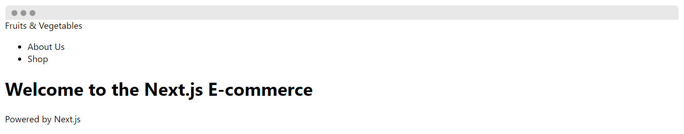

# Lab 02 - Routing and Navigation

## Routing

Routing is the process through which the user is navigated to different pages on a website. **Routes** in Next.js are based on the name of the files and the folder structure in the **pages directory**.

This file-based routing system defines the most common route patterns:

### Index Routes

Index routes automatically act as the default route for each directory.

```text
src/pages/index.js → /
src/pages/about.js → /about
src/pages/shop/index.js → /blog
```

> ✏ Create a new file `src/pages/shop/index.js` with the following content:
>
> ```jsx
> export default function Shop() {
>   return (
>     <>
>       <header></header>
>       <main>
>         <h1>Shop</h1>
>         <h2>Shop main page</h2>
>       </main>
>       <footer>
>         Powered by <a href="https://nextjs.org">Next.js</a>
>       </footer>
>     </>
>   );
> }
> ```
>
> Open http://localhost:3000/shop in your browser to see the new page.

If a user navigates to `/examplepage`, Next will look for that `examplepage.js` file in the pages directory or the `index.js` file in the `examplepage` subdirectory. If there is a default exported function for this page, it will render that as a component. Other wise it will go to the universal route which will be the 404 Page not found. Next.js provides a static 404 page by default without having to add any additional files, but it can be customized by creating a `src/pages/404.js` file.

> ✏ Create a new file `src/pages/404.js` to handle not found routes:
>
> ```jsx
> export default function Error404() {
>   return (
>     <>
>       <header></header>
>       <main>
>         <h1>Error 404</h1>
>         <h2>Page not Found</h2>
>       </main>
>       <footer>
>         Powered by <a href="https://nextjs.org">Next.js</a>
>       </footer>
>     </>
>   );
> }
> ```
>
> Navigate http://localhost:3000/examplepage in your browser to see the Error 404.

### Nested Routes

Next.js supports nested routes. A nested folder structure in the pages directory will be automatically routed in the same way.

```text
src/pages/shop/product.js → /shop/product
src/pages/dashboard/username/settings.js → /dashboard/username/settings
```

> ✏ Create a new file `src/pages/shop/product.js` with the following content:
>
> ```jsx
> export default function Product() {
>   return (
>     <>
>       <header></header>
>       <main>
>         <h1>Product page</h1>
>         <p>Product content</p>
>       </main>
>       <footer>
>         Powered by <a href="https://nextjs.org">Next.js</a>
>       </footer>
>     </>
>   );
> }
> ```
>
> Open http://localhost:3000/shop/product in your browser to see the new page.

### Dynamic Routes

To access a dynamic collection of pages requires either creating different routes or predefined paths for each one which is highly redundant and unscalable. Next.js allows defining dynamic routes by using square brackets. The bracket syntax in a file or folder name can used to match a dynamic segment:

```text
src/pages/shop/[product-slug].js → /shop/:product (/shop/avocado)
src/pages/dashboard/[username]/settings.js → /:username/settings (/johnsmith/settings)
```

> ✏ Rename the file `src/pages/shop/product.js` to `src/pages/shop/[product-slug].js`:
>
> ```jsx
> export default function Product() {
>   return (
>     <>
>       <header></header>
>       <main>
>         <h1>Product page</h1>
>         <p>Product content</p>
>       </main>
>       <footer>
>         Powered by <a href="https://nextjs.org">Next.js</a>
>       </footer>
>     </>
>   );
> }
> ```
>
> Open http://localhost:3000/shop/avocado in your browser. Instead of the 404 Error you see the product page.

In upcoming labs, we discuss how to extend dynamic route segments with Catch-all routes and how to use the Router component of Next.js.

## Navigation

### Link Component

The [Link](https://nextjs.org/docs/api-reference/next/link) component from next/link allows client-side navigation to different pages in the application.

**Client-side navigation** means that the page transition happens using JavaScript, which is faster than the default navigation done by the browser.

Next.js automatically optimizes the application for the best performance by **code-splitting**, loading only the code for the page that the user requests. But also, Next.js automatically **pre-fetches** in production the code for the linked pages in the background (using the built-in Link component in the current one) improving the page transition.

**Note**: To link to an external page outside the Next.js app, just use an `<a>` tag without Link.

> ✏ Create a new simple component `src/layout/Header/Header.jsx` to add the main navigation menu:
>
> ```jsx
> export default function Header() {
>   return (
>     <div className="app-header">
>       <Link href="/">Fruits & Vegetables</Link>
>       <nav className="main-nav">
>         <ul>
>           <li className="nav-item">
>             <span className="nav-link">
>               <Link href="/about">About Us</Link>
>             </span>
>           </li>
>           <li className="nav-item">
>             <span className="nav-link">
>               <Link href="/shop">Shop</Link>
>             </span>
>           </li>
>         </ul>
>       </nav>
>     </div>
>   );
> }
> ```
>
> Create a new index file to export layouts `src/layout/index.js`:
>
> ```js
> import Header from "./Header/Header";
>
> export { Header };
> ```
>
> Replace the `<header></header>` tags in all the pages with the new Header component:
>
> ```diff
> + import { Header } from "../layouts";
>
> [...]
>
> - <header></header>
> + <Header />
> ```

Next.js supports absolute imports and module path aliases. A common pattern is aliasing certain directories like `components` or `layouts` to use absolute paths.

> Create a jsconfig.js file in the next-app root:
>
> ```json
> {
>   "compilerOptions": {
>     "baseUrl": "./src",
>     "paths": {
>       "app.layouts/*": ["layouts/*"]
>     }
>   }
> }
> ```
>
> Restart the Next.js development server by running `npm run dev` or `yarn dev`.
>
> Replace the Header imports in all the pages:
>
> ```diff
> - import { Header } from "../layouts";
> + import { Header } from "app.layouts";
> ```
>
> Open http://localhost:3000/ in your browser and ensure the Header component is rendered:
>
> 

---

[<< **Prev**](../lab-01) | [**Next** >>](../lab-03)
