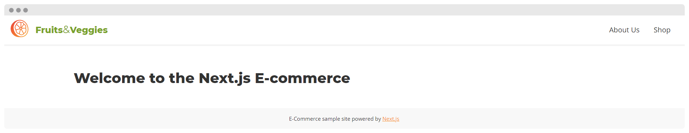

# Lab 03 - Styling, Assets and Layouts

## Styling

Next.js has built-in support for CSS and Sass which allows to import .css and .scss/.sass files. This is possible because Next.js extends the concept of import beyond JavaScript.

Next.js also supports CSS Modules using the [name].module.css file naming convention, scoping CSS by automatically creating a unique class name.

Taking advantage of this, let's use component-level Sass via CSS Modules and the .module.scss extension.

**Note**: Next.js has built-in support for other styling options like: [styled-jsx](https://github.com/vercel/styled-jsx), other popular CSS-in-JS libraries such as [styled-components](https://styled-components.com/) or [emotion](https://emotion.sh/), libraries like [Tailwind CSS](https://tailwindcss.com/) and even importing CSS files from `node_modules`.

### Adding Sass

Before you can use Next.js' built-in Sass support, be sure to install Sass.

> ✏ **Task**
>
> Install Sass in your Next.js application by running:
>
> ```bash
> npm install sass
> #or
> yarn add sass
> ```

The Sass compiler can be configured by using `sassOptions` in `next.config.js`.

### Adding a global stylesheet

To add a global stylesheet to the application, import the CSS or Sass file within `src/pages/_app.js`. These styles (styles.css) will apply to all pages and components in the application.

In development mode, expressing stylesheets this way allows your styles to be hot reloaded as you edit them. In production, all CSS files will be automatically concatenated into a single minified .css file.

> ✏ **Task**
>
> Remove all the contents in `src/styles`. Copy and paste the content from this lab into your empty directory.
>
> The content is a basic setup of a Sass stylesheet, including normalize, reset and base styling.
>
> Install normalize.css by running `npm install normalize.css` or `yarn add nromalize.css`.
>
> Update `next.config.js` by adding `sassOptions`:
>
> ```diff
> + const path = require("path");
>
> module.exports = {
>   reactStrictMode: true,
> +   sassOptions: {
> +    includePaths: [
> +      path.join(__dirname, "node_modules"),
> +      path.join(__dirname, "src/styles"),
> +    ],
>  },
> };
> ```
>
> Once done, import the new file `main.scss` in `src/pages/\_app.js`:
>
> ```diff
> - import '../styles/globals.css';
> + import "../styles/main.scss";
> ```
>
> Run your Next.js development server and open http://localhost:3000/

### Adding Component-Level Sass

CSS Module locally scopes CSS by automatically creating a unique class name. This allows you to use the same CSS class name in different files without worrying about collisions. In production, all CSS Module files will be automatically concatenated into many minified and code-split .css files.

> ✏ **Task**
>
> Add a Sass stylesheet `Header.modules.scss` in the `src/layouts/Header` folder:
>
> ```scss
> // Header styles
> @import "abstracts/variables";
>
> .container {
>   position: sticky;
>   top: 0;
>   display: flex;
>   align-items: center;
>   justify-content: space-between;
>   padding: $s-size $m-size;
>
>   &:after {
>     position: absolute;
>     left: 0;
>     right: 0;
>     top: 100%;
>     content: "";
>     width: 100%;
>     height: 4px;
>     background: linear-gradient(
>       #3b3b3b20 0px,
>       #3b3b3b20 1px,
>       #3b3b3b10 1px,
>       #3b3b3b00 4px
>     );
>   }
> }
>
> .logo {
>   display: flex;
>   align-items: center;
>   font-family: $title-font-family;
>   font-size: $l-size;
>   font-weight: 800;
>   color: $main-color;
>   text-decoration: none;
>
>   .logo__title {
>     margin-left: $m-size;
>   }
>
>   .ampersand {
>     font-weight: 400;
>     font-size: $xl-size;
>   }
> }
>
> .menu {
>   display: flex;
>   flex-wrap: wrap;
>   align-items: center;
>   margin: 0;
>   padding: 0;
>   list-style: none;
>   text-align: center;
> }
>
> .menu__item {
>   padding: $s-size $m-size;
>   line-height: $l-size;
> }
>
> .menu__link {
>   position: relative;
>   color: $text-color;
>   text-decoration: none;
>   transition: all 0.1s ease-in-out;
>
>   &:after {
>     position: absolute;
>     left: 0;
>     bottom: -($xl-size);
>     content: "";
>     width: 100%;
>     height: 0px;
>     background: $accent-color;
>     transition: all 0.1s ease-in-out;
>   }
>
>   &:hover,
>   &:focus {
>     color: $accent-color;
>
>     &:after {
>       height: 4px;
>     }
>   }
> }
> ```
>
> Import your Sass module into the Header component and add the corresponding class names:
>
> ```jsx
> import Link from "next/link";
> import styles from "./Header.module.scss";
>
> export default function Header() {
>   return (
>     <div className={styles.container}>
>       <Link href="/">
>         <a className={styles.logo}>
>           <span className={styles["logo__title"]}>
>             Fruits<span className={styles.ampersand}>&</span>Veggies
>           </span>
>         </a>
>       </Link>
>       <nav className={styles.navbar}>
>         <ul className={styles.menu}>
>           <li className={styles["menu__item"]}>
>             <Link href="/about">
>               <a className={styles["menu__link"]}>About Us</a>
>             </Link>
>           </li>
>           <li className={styles["menu__item"]}>
>             <Link href="/shop">
>               <a className={styles["menu__link"]}>Shop</a>
>             </Link>
>           </li>
>         </ul>
>       </nav>
>     </div>
>   );
> }
> ```

## Assets

Next.js can [serve static assets](https://nextjs.org/docs/basic-features/static-file-serving), like images or fonts, under the top-level public directory. Files inside `public` directory can be referenced from the root of the application.

### Images

The Next.js [Image](https://nextjs.org/docs/api-reference/next/image) component is an extension of the HTML `` element Next.js uses to enable automatic image optimization and resize, optimize and serve images in moderns formats like WebP when it is supported by the browser.

Image optimization works with any image source and can be configured for more advanced use cases via `next.config.js`. To enable image optimization for images hosted on an external website, use an absolute url for the `src` attribute and specify which `domains` are allowed to be optimized. To reduce the total number of possible generated images, configure deviceSizes and imageSizes:

```json
images: {
  domains: [],
  deviceSizes: [],
  imageSizes: []
}
```

Next.js optimizes images on-demand, as users request them, and are lazy-loaded by default.

> ✏ **Task**
>
> Download the content from `lab03/next-app/public` and place them into your `public` directory.
>
> Add the `logo.svg` to the Header by using the Image component:
>
> ```jsx
> <Link href="/">
>   <a className={styles.logo}>
>     <div className={styles.["logo__image"]}>
>       <Image
>       alt="Fruits and Veggies Logo"
>       src="/images/logo.svg"
>       width={40}
>       height={40}
>     />
>     </div>
>     <span className={styles["logo__title"]}>Fruits & Veggies</span>
>   </a>
> </Link>
> ```

### Fonts

Next.js has built-in web [**font optimization**](https://nextjs.org/docs/basic-features/font-optimization) to automatically inline font CSS at build time. It supports Google Fonts and Typekit.

To add a web font to your Next.js application, use the [**Head**](https://nextjs.org/docs/api-reference/next/head) component, a built-in Next.js component for appending elements to the `<head>` of the page and the custom [**Document**](https://nextjs.org/docs/advanced-features/custom-document) page:

> ✏ **Task**
>
> Create a new `src/pages/_document.js` file with the following content to use Google Fonts:
>
> ```jsx
> import Document, { Html, Head, Main, NextScript } from "next/document";
>
> class MyDocument extends Document {
>   render() {
>     return (
>       <Html lang="">
>         <Head>
>           <link rel="preconnect" href="https://fonts.googleapis.com" />
>           <link
>             rel="preconnect"
>             href="https://fonts.gstatic.com"
>             crossorigin
>           />
>           <link
>             href="https://fonts.googleapis.com/css2?family=Open+Sans:wght@400;700&display=swap"
>             rel="stylesheet"
>           />
>           <link
>             href="https://fonts.googleapis.com/css2?family=Montserrat:wght@400;800&display=swap"
>             rel="stylesheet"
>           />
>         </Head>
>         <body>
>           <Main />
>           <NextScript />
>         </body>
>       </Html>
>     );
>   }
> }
>
> export default MyDocument;
> ```
>
> Open your browser, navigate to http://localhost:3000/ and check that fonts are applied properly.

## Layouts

Many of the components of a Next.js application are often reused between pages. These components can be grouped into single or multiple layouts for the application, using them into pages to wrap your content.

> ✏ **Task**
>
> Let's start creating a new Footer component with its own styles in `src/layouts/Footer`.
>
> Content in `Footer.jsx`:
>
> ```jsx
> import styles from "./Footer.module.scss";
>
> export default function Footer() {
>   return (
>     <footer className={styles.container}>
>       E-Commerce sample site powered by{" "}
>       <a href="https://nextjs.org">Next.js</a>
>     </footer>
>   );
> }
> ```
>
> Content in `Footer.module.scss`:
>
> ````scss
> @import "abstracts/variables";
>
> .container {
>   position: sticky;
>   bottom: 0;
>   background-color: $light-gray-color;
>   padding: $s-size;
>   font-size: $s-size;
>   text-align: center;
> }
> ```
>
> Create a Main layout component in `src/layouts/Main` which will be shared across all pages.
>
> Add the following content:
>
> ```jsx
> import Head from "next/head";
> import { Header, Footer } from "app.layouts";
> import styles from "./Main.module.scss";
>
> export default function Main({ children }) {
>  return (
>    <>
>      <Head>
>        <meta
>          name="description"
>          content="Learn how to build a personal website using Next.js"
>        />
>      </Head>
>      <Header />
>      <main className={styles.container}>{children}</main>
>      <Footer />
>    </>
>  );
> }
> ````
>
> Create a `Main.module.scss` file:
>
> ```scss
> @import "abstracts/variables";
>
> .container {
>   max-width: $wrapper-width;
>   margin: auto;
>   padding: $xxl-size 0;
>   width: 100%;
> }
> ```
>
> Import for the Layout component into the application pages, removing the `<footer>` and `<main>` tags.
>
> This is an example for the `index.js` page:
>
> ```jsx
> import { Main } from "app.layouts";
>
> export default function Shop() {
>   return (
>     <Main>
>       <h1>Shop</h1>
>       <h2>Shop main page</h2>
>     </Main>
>   );
> }
> ```
>
> Run your development environment and open http://localhost:3000/ to see the result:
>
> 

[<< Prev](../lab-02) | [Next >>](../lab-04)
