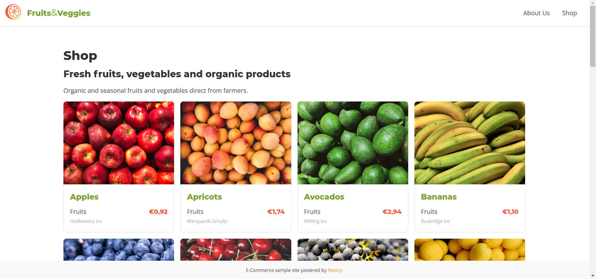
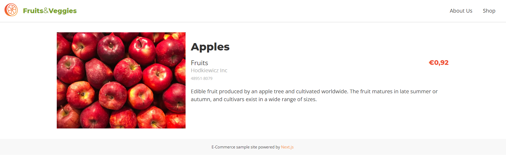

# Lab 05 - Static Site Generation

- [Lab 05 - Static Site Generation](#lab-05---static-site-generation)
  - [Static Generation without Data](#static-generation-without-data)
  - [Static Generation with Data](#static-generation-with-data)
    - [Creating an API Service](#creating-an-api-service)
  - [Using getStaticProps](#using-getstaticprops)
  - [Debugging getStaticProps](#debugging-getstaticprops)
  - [Rendering Static Props](#rendering-static-props)
  - [Using getStaticPaths](#using-getstaticpaths)
  - [📖 Resources to learn more](#-resources-to-learn-more)

**Note**: Static Site Generation fundamental concepts were addressed in detail in [Lab 00](./../lab-00/README.md#static-site-generation-ssg)

## Static Generation without Data

Static site generation of pages can be done in Next.js without fetching external data. These pages will be statically generated when the application is built for production.

However, pages often require getting some external data first: accessing the file system, getting an external API, or querying a database at compile time.

## Static Generation with Data

### Creating an API Service

Let's start creating a simple service for fetching data from the JSON Server using Axios.

> ✏ **Task**
>
> Create a new `api.js` file in `src/services/api`and delete the existing `hello.js` file:
>
> ```text
> src
> ├── services
> │   └── api
> │       └── api.js
> ```
>
> Add the following content to the file:
>
> ```js
> import axios from "axios";
>
> // Default Headers
> export const defaultHeaders = {
>   "Content-Type": "application/json;charset=utf-8",
> };
>
> // Initiate a new instance with Defaults
> export const api = axios.create({
>   baseURL: process.env.NEXT_PUBLIC_API_URL,
>   headers: defaultHeaders,
> });
> ```
>
> Create a new `index.js` file in the `services` folder to export the new API service:
>
> ```js
> import api from "./api/api";
>
> export { api };****
> ```
>
> Update the `next.config.js` by adding a new path:
>
> ```diff
> {
>  "compilerOptions": {
>    "baseUrl": "./src",
>    "paths": {
>      "app.layouts": ["layouts"],
> +    "app.services": ["services"]
>    }
>  }
> }
> ```

## Using getStaticProps

The getStaticProps is an async function that we need to export inside the page component. It can only be exported from a page and cannot be used in non-page files.

> ✏ **Task**
>
> Open `src/pages/shop/index.js` and apply getStaticProps to get all the products using the API:
>
> ```js
> import { api } from "app.services";
>
> [...]
>
> export async function getStaticProps(context) {
>   const response = await api.get("/products", {});
>   return {
>     props: {
>       products: response.data || []
>     }
>   };
> }
> ```

It executes before the page component and returns the object `props` to the page component. As getStaticProps runs at build time, you won’t be able to use data that’s only available during request time, such as query parameters or HTTP headers.

> ✏ **Task**
>
> Use the `props` object as argument to the Shop function.
>
> You can apply Object Destructuring to access directly the list of products.
>
> ```jsx
> export default function Shop({ products }) {
>   return (
>     <Main>
>       <h1>Shop</h1>
>       <h2>Fresh fruits, vegetables and organic products</h2>
>       <p>Organic and seasonal fruits and vegetables direct from farmers.</p>
>       <section className="product__grid">
>         {products.map((product, index) => {
>           return <div>{product.name}</div>;
>         })}
>       </section>
>     </Main>
>   );
> }
> ```

## Debugging getStaticProps

To debug server-side Next.js code you can use the [VS Code debugger](https://code.visualstudio.com/docs/editor/debugging)

> ✏ **Task**
>
> Create a file `.vscode/launch.json` at the root of your project with the following content:
>
> ```json
> {
>   "version": "0.2.0",
>   "configurations": [
>     {
>       "name": "Next: Server-side Debug",
>       "type": "pwa-node",
>       "request": "launch",
>       "runtimeExecutable": "${workspaceFolder}/next-app/node_modules/.bin/next",
>       "runtimeArgs": ["-p", "3000"],
>       "env": {
>         "NODE_OPTIONS": "--inspect"
>       },
>       "console": "integratedTerminal",
>       "cwd": "${workspaceFolder}/next-app",
>       "preLaunchTask": "Run server",
>       "postDebugTask": "Terminate running tasks"
>     },
>     {
>       "name": "Next: Client-side Debug",
>       "type": "chrome",
>       "request": "launch",
>       "url": "http://localhost:3000",
>       "webRoot": "${workspaceFolder}"
>     }
>   ],
>   "compounds": [
>     {
>       "name": "Next: Full-stack debug",
>       "configurations": ["Next: Server-side Debug", "Next: Client-side Debug"]
>     }
>   ]
> }
> ```
>
> Create a file `.vscode/tasks.json` at the root of your project with the following content:
>
> ```json
> {
>   "version": "2.0.0",
>   "tasks": [
>     {
>       "label": "Run server",
>       "type": "npm",
>       "script": "server:start",
>       "isBackground": true,
>       "presentation": {
>         "reveal": "always"
>       },
>       "problemMatcher": {
>         "owner": "npm",
>         "fileLocation": "relative",
>         "pattern": {
>           "regexp": "^([^\\s].*)\\((\\d+|\\,\\d+|\\d+,\\d+,\\d+,\\d+)\\):\\s+(error)\\s+(TS\\d+)\\s*:\\s*(.*)$",
>           "file": 1,
>           "location": 2,
>           "severity": 3,
>           "code": 4,
>           "message": 5
>         },
>         "background": {
>           "activeOnStart": true,
>           "beginsPattern": ".",
>           "endsPattern": "JSON Server is running"
>         }
>       }
>     },
>     {
>       "label": "Terminate running tasks",
>       "command": "echo ${input:terminate}",
>       "type": "shell"
>     }
>   ],
>   "inputs": [
>     {
>       "id": "terminate",
>       "type": "command",
>       "command": "workbench.action.tasks.terminate",
>       "args": "terminateAll"
>     }
>   ]
> }
> ```
>
> **Note**: If you are using yarn, please update the `tasks.json` file to run the yarn script to start the server.
>
> Add a breakpoint into the file `src/pages/shop/index.js` to check the received data in getStaticProps.
>
> Go to the Debug panel. You can push Ctrl+Shift+D on Windows/Linux or ⇧+⌘+D on macOS.
>
> Select "Next.js - Debug server-side" to launch this configuration.
>
> Press F5 or select Debug: Start Debugging from the Command Palette to start your debugging session.

In development, getStaticProps runs on every request, but in production, getStaticProps runs at build time. This behavior can be enhanced using the fallback key returned by getStaticPaths.

## Rendering Static Props

> ✏ **Task**
>
> Create a new `ProductCard` component that will receive the product information from `props`.
>
> Create a new file `src/components/ProductsCard/ProductsCard.jsx` and add the following content:
>
> ```jsx
> // Components
> import Link from "next/link";
> import Image from "next/image";
>
> // Styles
> import styles from "./ProductCard.module.scss";
>
> export default function ProductCard({ product }) {
>   const onClick = () => {};
>
>   return (
>     <article className={styles.container} onClick={onClick}>
>       <figure className={styles.figure}>
>         <Image
>           className={styles.image}
>           src={product.image}
>           alt={product.name}
>           layout="responsive"
>           width={320}
>           height={240}
>         />
>       </figure>
>       <div className={styles.body}>
>         <h3 className={styles.title}>
>           <Link href={`/shop/${product.slug}`}>
>             <a className={styles.link}>{product.name}</a>
>           </Link>
>         </h3>
>         <p className={styles.info}>
>           <span className={styles.category}>{product.category}</span>
>           <span className={styles.price}>{product.price}</span>
>           <span className={styles.manufacturer}>{product.manufacturer}</span>
>         </p>
>       </div>
>     </article>
>   );
> }
> ```
>
> Create a new file `ProductsCard.module.scss` in that directory to add styles to the ProductCard:
>
> ```scss
> @import "abstracts/variables";
> @import "base/typography";
>
> .container {
>   display: flex;
>   flex-direction: column;
>   position: relative;
>   text-decoration: none;
>   cursor: pointer;
>   transition: all 0.1s ease-in-out;
>
>   &:hover,
>   &:focus {
>     opacity: 0.9;
>     transform: scale(1.025);
>   }
> }
>
> .figure {
>   border-top-left-radius: $xs-size;
>   border-top-right-radius: $xs-size;
>   overflow: hidden;
>   background: $alt-gray-color;
> }
>
> .image {
>   display: block;
>   width: 100%;
>   height: auto;
>   margin: 0;
> }
>
> .link {
>   color: $main-color;
> }
>
> .body {
>   flex: 1;
>   padding: 0 $m-size $m-size;
>   border-width: 0 1px 1px 1px;
>   border-style: solid;
>   border-color: $alt-gray-color;
>   border-bottom-left-radius: $xs-size;
>   border-bottom-right-radius: $xs-size;
> }
>
> .info {
>   display: grid;
>   grid-template-columns: 3fr 1fr;
> }
>
> .price {
>   font-family: $title-font-family;
>   font-size: $m-size;
>   font-weight: 800;
>   color: $accent-color;
>   text-align: right;
> }
>
> .manufacturer {
>   font-size: $s-size;
>   color: $dark-gray-color;
> }
> ```
>
> Create an `index.js` file into `components`:
>
> ```js
> import ProductCard from "./ProductCard/ProductCard";
>
> export { ProductCard };
> ```
>
> And, finally, add to `jsconfig.json` the new path:
>
> ```json
> {
>   "compilerOptions": {
>     "baseUrl": "./src",
>     "paths": {
>       "app.layouts": ["layouts"],
>       "app.components": ["components"],
>       "app.services": ["services"]
>     }
>   }
> }
> ```

To define a list of secure image provider [domains](https://nextjs.org/docs/api-reference/next/image#domains) you need to configure them with the domains property in your `next.config.js` file.

To use a responsive configuration for the images [layout](https://nextjs.org/docs/api-reference/next/image#layout), you should use the imageSizes and deviceSizes in the next configuration to give information about how wide the image will be at different breakpoints.

> ✏ **Task**
>
> Update the `next.config.js` file to add specific domains and sizes for the images:
>
> ```js
> const path = require("path");
>
> module.exports = {
>   images: {
>     domains: ["localhost"],
>     imageSizes: [64, 128, 320, 512, 640],
>   },
>   reactStrictMode: true,
>   sassOptions: {
>     includePaths: [
>       path.join(__dirname, "node_modules"),
>       path.join(__dirname, "src/styles"),
>     ],
>   },
> };
> ```
>
> If you introduce changes in `next.config.js` a server restart is required to see the changes in effect.

You access the router object inside any function component in the app by using the [useRouter](https://nextjs.org/docs/api-reference/next/router#userouter) hook.

> ✏ **Task**
>
> Update the `ProductCard` component to add navigation to an specific Product by clicking on any place in the card:
>
> ```jsx
> // Next API
> import { useRouter } from "next/router";
>
> [...]
>
> export default function ProductCard({ product }) {
>   const router = useRouter();
>   const navigateToProduct = (event) => {
>     event.preventDefault();
>     router.push(`/shop/${product.slug}`);
>   };
>
>   [...]
>
> }
> ```
>
> Update the Shop page by using the new ProductCard component:
>
> ```jsx
> export default function Shop({ products }) {
>   return (
>     <Main>
>       <h1>Shop</h1>
>       <h2>Fresh fruits, vegetables and organic products</h2>
>       <p>Organic and seasonal fruits and vegetables direct from farmers.</p>
>       <section className="product__grid">
>         {products.map((product, index) => {
>           return (
>             <ProductCard key={`product-${product.id}`} product={product} />
>           );
>         })}
>       </section>
>     </Main>
>   );
> }
> ```
>
> Run your local environment and navigate to the Shop page: http://localhost.com/shop
>
> 

## Using getStaticPaths

If a page has dynamic routes (e.g. `[product_slug].js` page) and uses `getStaticProps` it needs to define a list of paths that have to be rendered to HTML at build time.

> ✏ **Task**
>
> Open `src\pages\shop\[product_slug].js` to add the getStaticPaths function:
>
> ```js
> export async function getStaticPaths() {
>   const paths = [];
>   const response = await api.get(`/products/`, {});
>   response.data.forEach((product) => {
>     var pathItem = {
>       params: { product_slug: product.slug },
>     };
>     paths.push(pathItem);
>   });
>   return {
>     paths,
>     fallback: false,
>   };
> }
> ```

The `getStaticPaths` function returns an object with the [paths](https://nextjs.org/docs/basic-features/data-fetching#the-paths-key-required) list and the [fallback](https://nextjs.org/docs/basic-features/data-fetching#the-fallback-key-required) keyword. The returned params list is not just an array of strings — it must be an array of objects, each one including the key or keys and their associated values.

The path of the current page can be accessed from the `context` received by `getStaticProps` and used to fetch the data for the product with a given `product_slug`.

> ✏ **Task**
>
> Use now `getStaticProps` in the page to fetch the product information:
>
> ```js
> export async function getStaticProps(context) {
>   const product_slug = context.params.product_slug;
>   const response = await api.get(`/products?slug=${product_slug}`, {});
>   return {
>     props: {
>       product: response.data[0],
>     },
>   };
> }
> ```
>
> And, finally, pass the product property to the page component:
>
> ```jsx
> export default function Product({ product }) {
>   return (
>     <Main>
>       
>       <h1>{product.name}</h1>
>       <p>{product.price}</p>
>       <p>{product.category}</p>
>       <p>{product.manufacturer}</p>
>       <p>{product.ref}</p>
>       <p>{product.description}</p>
>     </Main>
>   );
> }
> ```
>
> That’s it! Try visiting a product page: http://localhost:3000/shop/apples

In development, `getStaticPaths` runs on every request, but it runs only at build time in production.

> ✏ **Task**
>
> Refactor the `product_slug` page by creating a ProductDetails component.
>
> ```jsx
> // Components
> import { ProductDetail } from "app.components";
>
> [...]
>
> export default function Product({ product }) {
>   return (
>     <Main>
>       <ProductDetail product={product} />
>     </Main>
>   );
> }
> ```
>
> Create a new `ProductDetail` component and the related Sass module and export it in `src/components/index.js`:
>
> ```jsx
> // Components
> import Image from "next/image";
>
> // Styles
> import styles from "./ProductDetail.module.scss";
>
> export default function ProductDetail({ product }) {
>   return (
>     <article className={styles.container}>
>       <Image
>         src={product.image}
>         alt={product.name}
>         layout="responsive"
>         width={320}
>         height={240}
>       />
>       <section className={styles.section}>
>         <h1 className={styles.title}>{product.name}</h1>
>         <div className={styles.details}>
>           <p className={styles.info}>
>             <span className={styles.category}>{product.category}</span>
>             <span className={styles.manufacturer}>
>               {product.manufacturer}
>             </span>
>             <span className={styles.reference}>{product.ref}</span>
>           </p>
>           <p className={styles.price}>{product.price}</p>
>         </div>
>         <p className={styles.description}>{product.description}</p>
>       </section>
>     </article>
>   );
> }
> ```
>
> ```scss
> // ProductCard styles
> @import "abstracts/variables";
> @import "abstracts/mixins";
> @import "base/typography";
>
> .container {
>   display: grid;
>   grid-template-columns: 1fr;
>   grid-gap: $m-size;
>
>   @include breakpoint("medium") {
>     grid-template-columns: 1fr 1fr;
>   }
>
>   @include breakpoint("large") {
>     grid-template-columns: 1fr 2fr;
>   }
> }
>
> .details {
>   display: flex;
>   justify-content: space-between;
> }
>
> .info {
>   display: flex;
>   flex-direction: column;
> }
>
> .price {
>   font-family: $title-font-family;
>   font-size: $l-size;
>   font-weight: 800;
>   color: $accent-color;
>   text-align: right;
> }
>
> .category {
>   font-size: $l-size;
> }
>
> .manufacturer {
>   color: $dark-gray-color;
> }
>
> .reference {
>   font-size: $s-size;
>   color: $dark-gray-color;
> }
>
> .description {
>   margin: $m-size 0;
> }
> ```
>
> Run your local environment and navigate to the Shop page: http://localhost.com/shop/apples
>
> 

## 📖 Resources to learn more

- [**Data Fetching examples with Next.js**](https://nextjs.org/docs/basic-features/data-fetching)
- [**Dynamic Routing in Next.js**](https://nextjs.org/docs/routing/dynamic-routes)
- [**Debugging in VS Code**](https://code.visualstudio.com/docs/editor/debugging)
- [**Debugging Recipes for VS Code**](https://code.visualstudio.com/docs/nodejs/debugging-recipes)
- [**Next Router API**](https://nextjs.org/docs/api-reference/next/router)
- [**Next Image API**](https://nextjs.org/docs/api-reference/next/image)

---

[<< **Prev**](../lab-03) | [**Next** >>](../lab-05)
